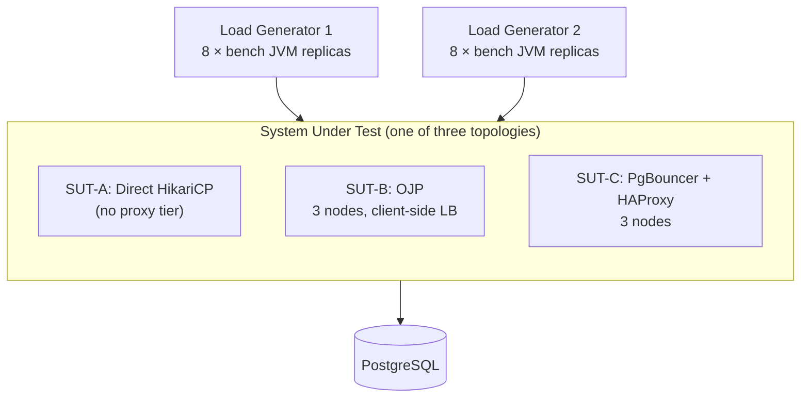
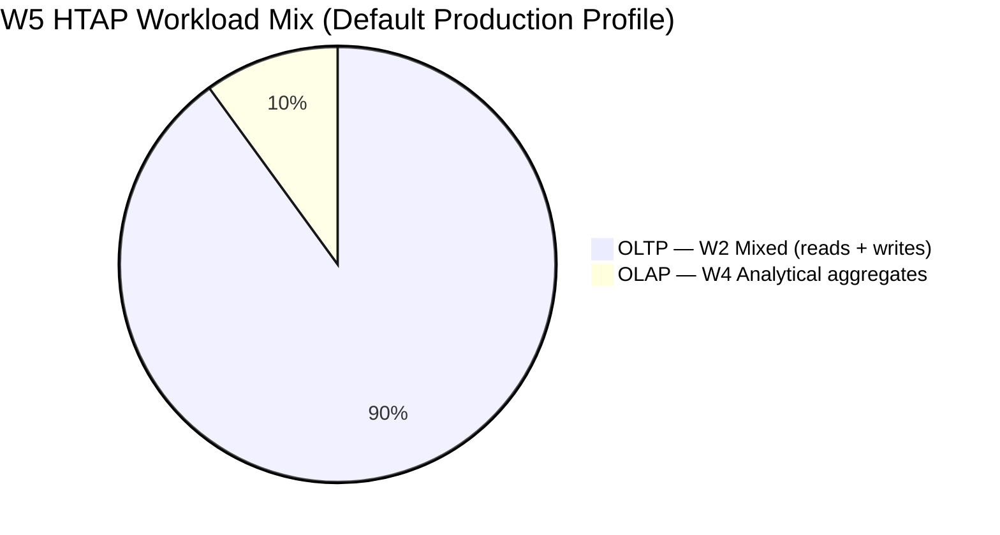
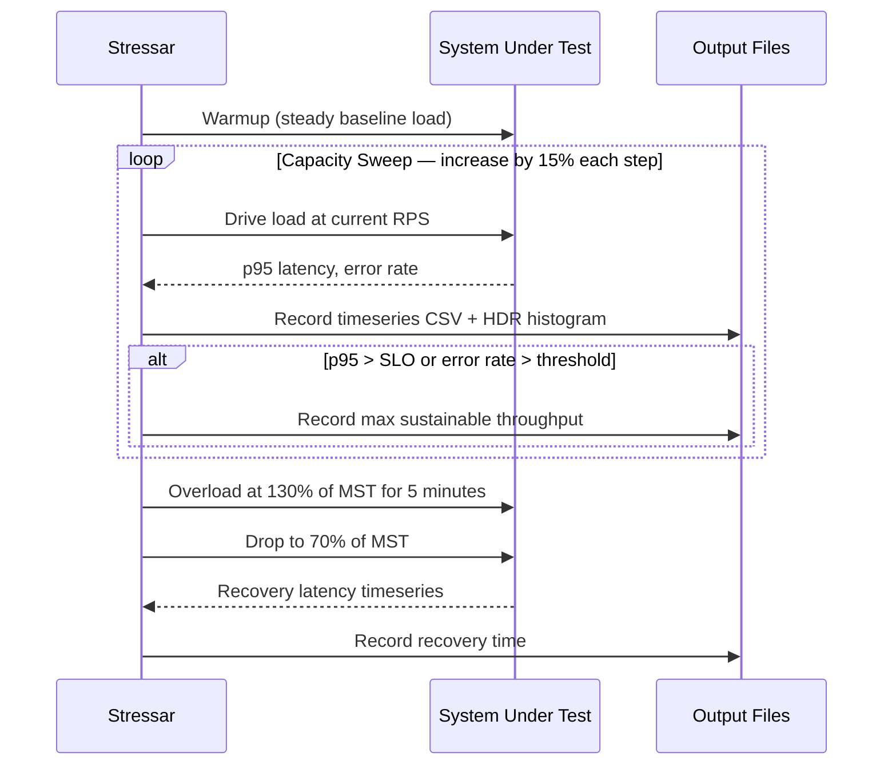

# Introducing Stressar: A Stress Tool Built for the JDBC World

If you have ever tried to benchmark a Java application's database layer, you have probably reached for `pgbench`, JMeter, or maybe Gatling. They are solid, well-understood tools. But here is the thing — none of them actually model what your Java application does when it talks to a database. They all speak a different language. `pgbench` is a C program that opens connections directly. JMeter and Gatling are HTTP-centric by nature. When you need to understand how your JDBC driver, your connection pool, and your proxy middleware behave under real load, you are largely on your own. That gap is exactly why Stressar was built.

## The Gap Nobody Was Filling

PostgreSQL connection pooling is one of those topics that everyone has opinions about but almost nobody has data on — at least not data that Java developers can actually use. Discussions about PgBouncer, for example, are filled with `pgbench` numbers. `pgbench` is a perfectly reasonable tool for measuring PostgreSQL engine throughput, but it does not go through JDBC. It does not exercise the PostgreSQL JDBC driver's prepared-statement protocol. It has no concept of HikariCP pools, session-level `SET` commands, or the subtle way that PgBouncer in transaction mode interacts with named prepared statements. If you are a Java developer trying to decide whether to put PgBouncer in front of your PostgreSQL cluster, those `pgbench` numbers tell you very little about what will actually happen to your application.

The JDBC-specific costs are real and non-trivial. Every time a HikariCP pool acquires a fresh server connection, the JDBC driver runs an authentication exchange and applies session-level settings. In transaction-pooling mode, PgBouncer multiplexes your persistent client connection onto a smaller pool of server connections — which means those session-initialisation steps can be triggered more frequently than you might expect. Named prepared statements add another layer of complexity: PgBouncer cannot propagate server-side named statements across different backend connections, so the driver falls back to unnamed statements and the overhead changes accordingly. None of this is visible to a C-language benchmark tool. You need a JDBC client to see it.

## Why Closed-Loop Load Generation Is the Wrong Model

Beyond the JDBC client problem, there is a more subtle issue with how most tools generate load. The typical approach is closed-loop: you configure a number of concurrent threads or virtual users, each of which sends a request and waits for the response before sending the next one. The problem is that when the system slows down, the load drops too. Your 50-thread pool can only generate as many requests per second as `50 / mean_latency_in_seconds`. The moment your database starts queuing, the arrival rate automatically falls — and you never actually observe the queueing behaviour that dominates production incidents.

What you really want is open-loop load generation: issue requests at a fixed arrival rate regardless of how long previous requests took. This is what production traffic looks like. Users do not wait for the previous user to finish before clicking. Open-loop scheduling is the only way to correctly trace the full throughput–latency curve and see where the system transitions from linear latency growth to unbounded queue depth. Stressar implements open-loop scheduling using Java's `ScheduledExecutorService.scheduleAtFixedRate`, which drives the arrival rate entirely independently of workload completion.

## What Stressar Actually Does

Stressar is a purpose-built JDBC stress harness. It connects to PostgreSQL through whichever connectivity layer you want to test — a direct HikariCP pool, OJP (Open J Proxy), or PgBouncer behind HAProxy — and drives a configurable workload at a controlled arrival rate while collecting accurate latency histograms.

The architecture is deliberately designed to mirror how real microservices are deployed. Rather than a single process, a full benchmark run uses sixteen independent JVM processes split across two load-generator machines, each holding its own connection pool. This matters because it creates the same connection-fragmentation pattern that you see in a real horizontally-scaled deployment, where each pod or container maintains its own pool. A single-client benchmark cannot model this.



The three reference topologies each represent a realistic production pattern. In the HikariCP baseline, every one of the sixteen replicas maintains its own pool of roughly nineteen connections, totalling around three hundred backend connections. This is the disciplined-pooling model: you fix a total connection budget and divide it equally among replicas rather than configuring the same pool size regardless of how many replicas you run. Without this discipline, your total backend-connection count grows linearly with scale and will eventually saturate PostgreSQL's `max_connections`. The OJP and PgBouncer scenarios both use a much smaller backend-connection budget — forty-eight connections spread across three proxy nodes — because the proxy tier handles the multiplexing.

## Five Workloads That Represent Real Applications

A benchmark is only as useful as its workload. Stressar ships with five workloads that cover the range of patterns you encounter in real Java applications.

The simplest workload, W1, is pure reads: a mix of account lookups and order-history queries. W2 is the transactional workhorse — it inserts orders with line items and performs the mixed read/write activity that characterises an e-commerce or financial application. W3 exists to model the tail of a realistic query distribution: ninety-nine percent fast queries, one percent heavy aggregates. If your connection pool has any interaction with long-running queries, W3 will expose it. W4 is a pure analytical workload, running complex aggregations across large tables. W5 is the HTAP blend, the default production-comparison workload: ninety percent OLTP mixed traffic and ten percent analytical, which represents the general-purpose application profile where transactional work dominates but a continuous reporting or analytics stream competes for the same connections.



The data set itself is seeded with a deterministic pseudorandom number generator (Xoshiro256\*\*), so every run on the same data-set size produces the same sequence of account IDs and order amounts. Combined with the environment snapshot that Stressar captures at the start of every run — hardware, OS, JVM version, JDBC driver version, database configuration — this makes results fully reproducible. Someone else with the same machines can run the exact same benchmark and get comparable numbers, which matters if you want to publish results or share them with your team.

## The Two Test Protocols

Given a target system, Stressar runs two complementary tests. The capacity sweep (Test A) gradually increases the request rate in fifteen-percent steps, recording p50, p95, and p99 latency and the error rate at each level. It stops when the system can no longer sustain throughput within the configured SLO — the default threshold is p95 latency below one hundred and fifty milliseconds. The result is each system's maximum sustainable throughput, and you get the full shape of the latency curve, not just a single operating point.

The overload-and-recovery test (Test B) takes that maximum and deliberately overshoots it. Load is driven to one hundred and thirty percent of maximum sustainable throughput for five minutes, then dropped to seventy percent. How long does it take for tail latency to return to SLO-compliant levels? That recovery time is a critical operational metric that existing benchmarks simply do not measure. If your connection pooler queues up a backlog under a traffic spike, knowing whether it drains in two seconds or two minutes changes how you size your system and how you design your retry logic.



Latency is measured using HdrHistogram, which avoids the coordinated omission problem — the subtle but common error where a benchmark that waits for a response before issuing the next request under-reports tail latency. Because requests are issued at a fixed rate independently of completion, slow responses accumulate as outstanding work rather than reducing the arrival rate. The histograms record accuracy to 0.1% across six orders of magnitude and are written in the HdrHistogram binary format for post-hoc reanalysis.

## Getting Started

Building Stressar takes a single Gradle command and produces a self-contained executable.

```bash
./gradlew installDist
```

The binary lands at `build/install/stressar/bin/bench`. Before running a benchmark you initialise the database with a sample data set, choosing scale factors that suit your available hardware.

```bash
build/install/stressar/bin/bench init-db \
  --jdbc-url "jdbc:postgresql://localhost:5432/benchdb" \
  --username benchuser \
  --password benchpass \
  --accounts 10000 \
  --items 5000 \
  --orders 50000
```

From there, a benchmark run is driven by a YAML configuration file that describes the workload type, load mode, arrival rate, pool settings, and output path. The `examples/` directory contains ready-to-use files for all three reference topologies and all five workloads. Running a capacity sweep to find the maximum sustainable throughput for a PgBouncer deployment, for instance, is a matter of pointing at the right configuration and letting it run.

```bash
build/install/stressar/bin/bench sweep \
  --config examples/ta-pgbouncer.yaml \
  --output results/pgbouncer-sweep/
```

The output is a directory of per-second timeseries CSVs, HDR histogram logs, and a summary JSON that captures the environment snapshot, final latency percentiles, and maximum sustainable throughput. For multi-replica runs, an `aggregate` command merges results across all sixteen JVM instances into a single combined report.

## The Bigger Picture

Stressar was built to answer a specific question: for Java applications using JDBC, what is the actual, measurable difference between connecting directly through HikariCP, routing through PgBouncer, and using OJP's virtual-connection model? That question has always been hard to answer rigorously because the tools available either spoke the wrong protocol, generated load in the wrong way, or both.

The broader ambition is for Stressar to become a reusable harness for any JDBC workload comparison. The workload engine and load-generation model are not PostgreSQL-specific. Adding a new system under test — a different database, a different proxy, a different driver configuration — means writing a configuration file and, if needed, a new workload implementation. The measurement model, the reproducibility guarantees, and the two test protocols come along for free.

If you are trying to make a data-driven decision about your Java application's database connectivity layer, Stressar gives you the numbers that other tools cannot.
