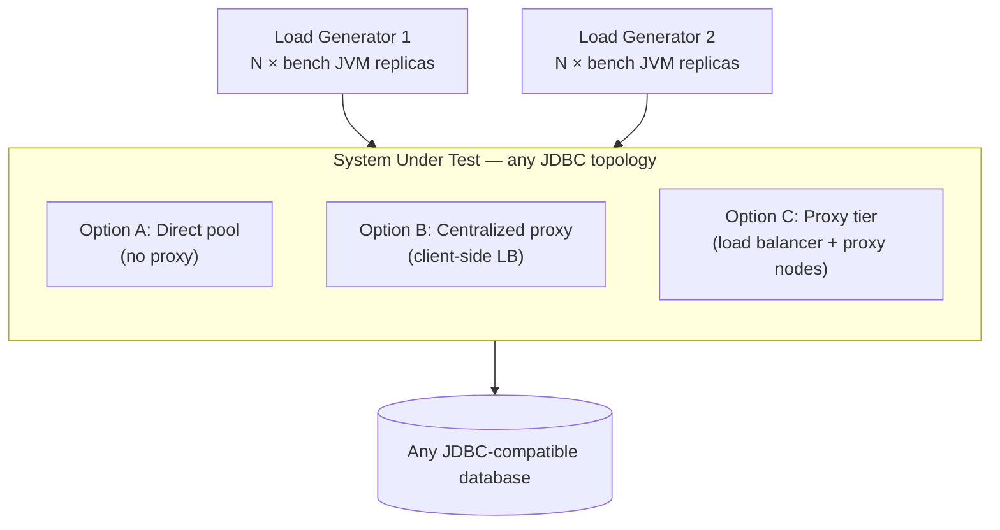
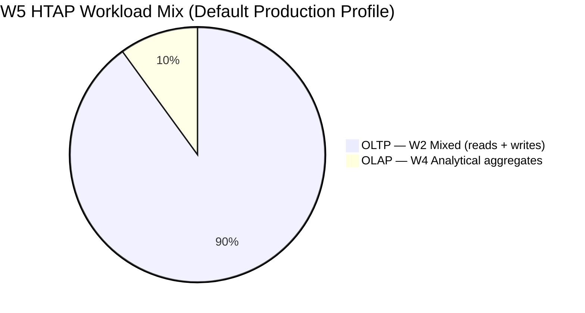
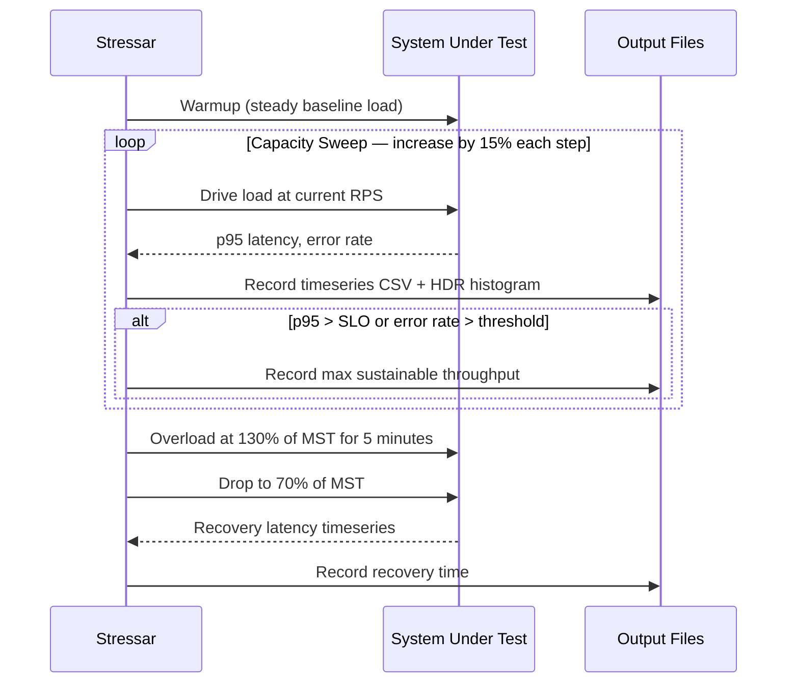

# Introducing Stressar: A Stress Tool Built for the JDBC World

If you have ever tried to benchmark a Java application's database layer, you have probably reached for JMeter, Gatling, or maybe a database-native tool like `pgbench` or `sysbench`. They are solid, well-understood tools — but none of them actually model what your Java application does when it talks to a database. JMeter and Gatling are HTTP-centric by design. Database-native tools like `pgbench` and `sysbench` are C programs that bypass JDBC entirely. When you need to understand how your JDBC driver, your connection pool, and your proxy middleware actually behave under real load, you are largely on your own. That gap is exactly why Stressar was built.

## The Gap Nobody Was Filling

Connection management is one of those topics that every Java developer wrestles with but almost nobody has good data on — at least not data collected through the same JDBC stack that production applications use. The tools available today measure the database engine or the HTTP layer. They do not measure the JDBC layer.

The JDBC-specific costs are real and non-trivial. Every time a connection pool acquires a fresh server connection, the JDBC driver runs an authentication exchange and applies session-level settings. Proxy middleware adds its own interactions on top of that: depending on the pooling mode and how the proxy handles the extended query protocol, named prepared statements may behave differently from what you configured, the session-initialisation overhead may be paid more or less frequently, and the overhead profile changes per driver. None of this is visible to a C-language benchmark tool. You need a JDBC client to see it. The point is not that any particular database or proxy is better or worse — it is that you cannot make a data-driven decision about your Java application's connectivity layer without measuring through JDBC.

Stressar is designed to close that gap. It connects to any JDBC-compatible database through whichever connectivity layer you want to test — a direct connection pool, a sidecar proxy, a centralized pooler, or anything else that exposes a JDBC URL — and drives a configurable workload at a controlled arrival rate while collecting accurate latency histograms.

## Why Closed-Loop Load Generation Is the Wrong Model

Beyond the JDBC client problem, there is a more subtle issue with how most tools generate load. The typical approach is closed-loop: you configure a number of concurrent threads or virtual users, each of which sends a request and waits for the response before sending the next one. The problem is that when the system slows down, the load drops too. Your 50-thread pool can only generate as many requests per second as `50 / mean_latency_in_seconds`. The moment your database starts queuing, the arrival rate automatically falls — and you never actually observe the queueing behaviour that dominates production incidents.

What you really want is open-loop load generation: issue requests at a fixed arrival rate regardless of how long previous requests took. This is what production traffic looks like. Users do not wait for the previous user to finish before clicking. Open-loop scheduling is the only way to correctly trace the full throughput–latency curve and see where the system transitions from linear latency growth to unbounded queue depth. Stressar implements open-loop scheduling using Java's `ScheduledExecutorService.scheduleAtFixedRate`, which drives the arrival rate entirely independently of workload completion.

## What Stressar Actually Does

Stressar is a JDBC stress harness built around three core ideas: test through the real JDBC stack, generate load the way production traffic arrives, and model how real microservices are deployed.

Rather than a single process, a full benchmark run uses multiple independent JVM processes — the bundled PostgreSQL reference scenario uses sixteen, split across two load-generator machines — each holding its own connection pool. This creates the same connection-fragmentation pattern that you see in a real horizontally-scaled deployment, where each pod or container maintains its own pool. A single-client benchmark cannot model this, and that limitation shows up in the numbers.

The system under test can be anything behind a JDBC URL. You configure the connectivity layer in a YAML file, point Stressar at it, and the tool handles the rest. The bundled reference scenarios cover three topologies that represent the most common Java connectivity patterns: a direct connection pool, a centralized proxy with client-side load balancing, and a proxy tier fronted by a load balancer. But the design is intentionally not tied to any of those specifics.



One design choice worth explaining is the disciplined-pooling model. When an application is horizontally scaled, each replica maintains its own pool. Without explicit discipline, engineers often configure the same pool size regardless of how many replicas are running, which means total backend connections grow linearly with scale and eventually saturate the database's connection limit. The correct approach is to fix a total connection budget and divide it equally among replicas. Stressar's `HIKARI_DISCIPLINED` mode enforces this and makes it a first-class measurement variable — you can see directly how budget-enforced pooling compares to a proxy that handles the same budget enforcement centrally.

## Five Workloads That Represent Real Applications

A benchmark is only as useful as its workload. Stressar ships with five workloads that cover the range of patterns you encounter in real Java applications, built around a simple schema of accounts, items, orders, and order lines.

The simplest workload, W1, is pure reads. W2 is the transactional workhorse — it inserts orders with line items and performs the mixed read/write activity that characterises an e-commerce or financial application. W3 exists to model the tail of a realistic query distribution: ninety-nine percent fast queries, one percent heavy aggregates. If your connection pool has any interaction with long-running queries, W3 will expose it. W4 is a pure analytical workload, running complex aggregations across large tables. W5 is the HTAP blend, the default production-comparison workload: ninety percent OLTP mixed traffic and ten percent analytical, which represents the general-purpose application profile where transactional work dominates but a continuous reporting or analytics stream competes for the same connections.



The data set itself is seeded with a deterministic pseudorandom number generator (Xoshiro256\*\*), so every run on the same data-set size produces the same sequence of entity IDs and transaction amounts. Combined with the environment snapshot that Stressar captures at the start of every run — hardware, OS, JVM version, JDBC driver version, database configuration — this makes results fully reproducible. Someone else with the same machines can run the exact same benchmark and get comparable numbers, which matters if you want to publish results or share them with your team.

## The Two Test Protocols

Given a target system, Stressar runs two complementary tests. The capacity sweep (Test A) gradually increases the request rate in fifteen-percent steps, recording p50, p95, and p99 latency and the error rate at each level. It stops when the system can no longer sustain throughput within the configured SLO — the default threshold is p95 latency below one hundred and fifty milliseconds. The result is each system's maximum sustainable throughput, and you get the full shape of the latency curve, not just a single operating point.

The overload-and-recovery test (Test B) takes that maximum and deliberately overshoots it. Load is driven to one hundred and thirty percent of maximum sustainable throughput for five minutes, then dropped to seventy percent. How long does it take for tail latency to return to SLO-compliant levels? That recovery time is a critical operational metric that existing benchmarks simply do not measure. If your connectivity layer queues up a backlog under a traffic spike, knowing whether it drains in two seconds or two minutes changes how you size your system and how you design your retry logic.



Latency is measured using HdrHistogram, which avoids the coordinated omission problem — the subtle but common error where a benchmark that waits for a response before issuing the next request under-reports tail latency. Because requests are issued at a fixed rate independently of completion, slow responses accumulate as outstanding work rather than reducing the arrival rate. The histograms record accuracy to 0.1% across six orders of magnitude and are written in the HdrHistogram binary format for post-hoc reanalysis.

## Getting Started

Building Stressar takes a single Gradle command and produces a self-contained executable.

```bash
./gradlew installDist
```

The binary lands at `build/install/stressar/bin/bench`. Before running a benchmark you initialise the database with a sample data set, choosing scale factors that suit your available hardware. The `--jdbc-url` accepts any valid JDBC URL, so the same command works regardless of which database you are targeting.

```bash
build/install/stressar/bin/bench init-db \
  --jdbc-url "jdbc:postgresql://localhost:5432/benchdb" \
  --username benchuser \
  --password benchpass \
  --accounts 10000 \
  --items 5000 \
  --orders 50000
```

From there, a benchmark run is driven by a YAML configuration file that describes the workload type, load mode, arrival rate, pool settings, and output path. The `examples/` directory contains ready-to-use files covering the reference topologies and all five workloads. Running a capacity sweep is a matter of pointing at the right configuration and letting it run.

```bash
build/install/stressar/bin/bench sweep \
  --config examples/ta-baseline-hikari.yaml \
  --output results/hikari-sweep/
```

The output is a directory of per-second timeseries CSVs, HDR histogram logs, and a summary JSON that captures the environment snapshot, final latency percentiles, and maximum sustainable throughput. For multi-replica runs, an `aggregate` command merges results across all JVM instances into a single combined report.

## The Bigger Picture

The first reference scenarios in Stressar compare PostgreSQL connectivity topologies — direct HikariCP pooling, PgBouncer behind HAProxy, and OJP with client-side load balancing — because that was the immediate problem: Java developers had no rigorous, JDBC-based basis for choosing between these options. Those scenarios ship with the repository and are ready to run.

But the tool itself is not about PostgreSQL. The workload engine and load-generation model work through JDBC, which means the same benchmark harness applies to MySQL, Oracle, SQL Server, CockroachDB, or any other database with a JDBC driver. Adding a new system under test means writing a configuration file and, if needed, a new workload implementation. The measurement model, the reproducibility guarantees, and the two test protocols come along for free.

If you are trying to make a data-driven decision about your Java application's database connectivity layer — whether that means picking a connection pool, evaluating a proxy, comparing databases, or understanding how your system behaves under a traffic spike — Stressar gives you the numbers that other tools cannot.
